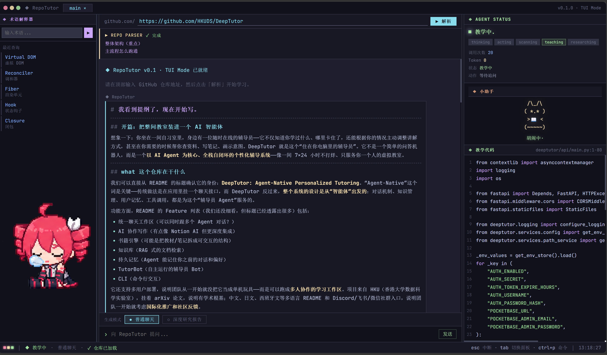

# Repo Tutor

> **重要声明 — 上游来源与许可证**
>
> 本项目是基于 [DeepTutor](https://github.com/Deep-Tutor/DeepTutor) 仓库的衍生作品（fork / 复制并大幅改写）。原始 DeepTutor 代码采用 **Apache License 2.0**，其完整许可证副本保留在本仓库的 [`DeepTutor/LICENSE`](DeepTutor/LICENSE)，原始版权与归属声明未被移除。
>
> 本项目整体（包括对 DeepTutor 的修改、以及 `new_kernel/`、`web_v4/` 等新增代码）以 **GNU Affero General Public License v3.0 (AGPL-3.0)** 发布，许可证全文见根目录 [`LICENSE`](LICENSE)。
>
> Apache 2.0 与 AGPL-3.0 单向兼容（Apache 2.0 代码可被纳入 AGPL-3.0 项目）。任何使用、修改或通过网络对外提供本项目服务的行为，均须遵守 AGPL-3.0；其中源自 DeepTutor 的部分还需同时遵守 Apache 2.0 的归属与通知要求。

---

## 项目简介

Repo Tutor 是一个面向**初中级开发者**的、只读的 GitHub 仓库**教学型 Agent**。它不是仓库搜索器，也不是一问一答的 Q&A 机器人，而更像"一位陪你坐下来读源码的助教"。

很多人学完语言基础后会卡在同一个地方：能写小项目，但一打开真实的工程级开源仓库，就在文件树里迷路——不知道该从哪里看起、哪些是主干哪些是枝节、为什么这里要拆成这么多文件、某个看似奇怪的设计到底在解决什么问题。Repo Tutor 想要解决的就是这个"从能写代码到能读懂别人工程"的鸿沟。

使用方式很简单：你给它一个**中、小、大型开源仓库的 GitHub URL**，它会克隆并通读这个仓库，然后以对话的形式带你读。它会先帮你建立最小工程认知——这个系统在解决什么问题、主要由哪几部分构成、模块之间怎样配合；再在当前仓库里挑出**最值得先讲透的一个点**，用少量源码锚点（具体的文件、函数、行号）把这个点讲清楚；接着沿着一条**持续推进**的教学路径，一轮一轮地带你深入下去，而不是每次都重置上下文从头讲起。

它的目标不是让你"记住这一个仓库的细节"，而是帮你把读懂这一个仓库的过程，沉淀成可以迁移到下一个仓库的**工程经验与工程直觉**——例如分层意识、关注点分离的嗅觉、对常见架构模式的识别能力、以及阅读陌生代码时该先看哪里的本能。简而言之：**让一个会基础编程、但还没真正读过工程级开源代码的人，借助 Repo Tutor 持续阅读真实仓库，从而长出工程经验和工程直觉。**

- **后端**：[`new_kernel/`](new_kernel/)
- **前端**：[`web_v4/`](web_v4/)

## 示例



## 启动方式

在仓库根目录运行：

```powershell
.\start.ps1
```

该脚本会在两个独立 PowerShell 窗口中分别拉起：

- 后端 (`new_kernel`) + 前端 (`web_v4`) 开发服务
- Teto 桌面伴随宠物（可选 UI）

关闭对应窗口即可停止其进程。

## 使用方法

1. 运行 `start.ps1`，等待两个窗口启动完毕。
2. 在浏览器中打开前端页面（启动脚本会提示地址）。
3. **复制一个 GitHub 仓库 URL**（例如 `https://github.com/owner/repo`），粘贴到输入框，回车提交。
4. 等待初始分析完成后，围绕源码证据继续提问即可。

## 目录概览

| 路径 | 说明 |
| --- | --- |
| `new_kernel/` | 当前后端（FastAPI + SSE + deep research 循环） |
| `web_v4/` | 当前前端 |
| `DeepTutor/` | 上游 DeepTutor 仓库副本（Apache 2.0，原样保留） |
| `start.ps1` | 一键启动脚本（Windows / PowerShell） |
| `scripts/` | 启动与开发辅助脚本 |
| `LICENSE` | 本项目 AGPL-3.0 许可证 |

## 致谢 (Acknowledgements)

衷心感谢以下项目，没有它们就没有本项目：

- **[DeepTutor](https://github.com/Deep-Tutor/DeepTutor)** — 本项目的直接上游。Repo Tutor 复制了 DeepTutor 的仓库结构与部分核心思路，并在此基础上重写了内核与前端。原始作者及其贡献者在此一并致谢。许可证：Apache License 2.0。

-“这段是人写的”：第一次自己完成这么大的项目还挺有成就感的，但是大部分（其实是全部）都是agent帮我完成的，说来不好意思我感觉我用ai玷污了deeptutor，实在抱歉。其实除了deeptutor和港大实验室，我更想致谢claude gpt deepseek glm codebuddy虽然想ai致谢很搞笑，但是确实一直在鼓励我和一直被我使唤，主要是唤起我的兴趣了真的很感谢，

## 示例截图


## LLM 配置

Repo Tutor 需要一个 LLM 才能工作。配置文件位于仓库根目录：

```
llm_config.json
```

> 注意：`llm_config.json` **已加入 `.gitignore`**，不会被提交到 GitHub。仓库里只提供模板 [`llm_config.example.json`](llm_config.example.json)。第一次使用时，把模板复制为 `llm_config.json`，再填入你自己的 key。

最小字段示例：

```json
{
  "api_key": "你的_API_KEY",
  "base_url": "https://api.deepseek.com",
  "model": "deepseek-chat",
  "timeout_seconds": 60
}
```

字段说明：

| 字段 | 说明 |
| --- | --- |
| `api_key` | 你的模型服务 API Key |
| `base_url` | OpenAI 兼容协议的接口根地址 |
| `model` | 模型名 |
| `timeout_seconds` | 单次请求超时（秒），可省略 |

### 支持的模型服务

- ✅ **DeepSeek** — 已实测可用，是当前推荐 / 默认配置（`base_url = https://api.deepseek.com`，`model = deepseek-chat`）。
- ⚙️ **其他 OpenAI SDK 兼容服务** — 理论上都能用：只要服务实现了 OpenAI Chat Completions 兼容协议，把 `base_url` 和 `model` 换成对应供应商的值即可。**但这些供应商未经过本项目实测**，遇到协议差异（例如 streaming 格式、tool-calling 字段命名等）可能需要自行适配。

如果你不确定要用什么，**直接照默认 DeepSeek 的写法填一个自己的 key 就行**。

### 用环境变量覆盖（可选）

如果不想把 key 写进 `llm_config.json`，可以改用环境变量：

- `REPO_TUTOR_LLM_API_KEY`
- `REPO_TUTOR_LLM_BASE_URL`
- `REPO_TUTOR_LLM_MODEL`
- `REPO_TUTOR_LLM_TIMEOUT_SECONDS`

环境变量优先级高于 `llm_config.json`。

## AGPL-3.0 关键义务提示

如果你修改本项目并通过网络对外提供服务（例如部署成 SaaS），AGPL-3.0 要求你必须以同样的协议向你的用户公开你的修改后源码。请在使用前确认你能够履行该义务。
