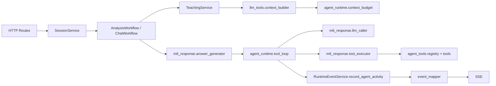

# backend agent_runtime 模块全面解析

本文聚焦 `backend/agent_runtime/`，目标不是只做文件级简介，而是回答 5 个问题：

1. `agent_runtime` 在整个后端里到底扮演什么角色？
2. 它的上游是谁、下游是谁？
3. 它的内部架构怎么分层？
4. 它提供了哪些功能？
5. 这些功能是如何被内部架构实现出来的？

如果先用一句话概括：

> `agent_runtime` 是 Repo Tutor 后端里的“工具编排层”。它不负责 Session 管理，不直接解析最终答案，也不直接访问 HTTP；它专门负责两件事：先把有限、可信、可裁剪的工具证据装进 prompt，再在回答生成过程中按需发起只读工具调用，并把整个工具交互过程转成可观察的流式活动事件。

---

## 1. 模块定位

从职责上看，`agent_runtime` 夹在三类系统之间：

1. 上游是 `m5_session` 和 `llm_tools`
2. 下游一端是 `agent_tools`
3. 下游另一端是 `m6_response`

它不是业务总控，而是一个专门处理“LLM 如何安全、节制、可观测地使用工具”的子层。

更准确地说，它负责把“工具能力”分成两段使用：

1. **回答前**：预先塞一小批高价值工具结果，形成 `LlmToolContext`
2. **回答中**：如果模型还需要证据，再进入实时 tool loop

所以它解决的是一个非常具体的问题：

> 既要让模型能读仓库证据，又不能把所有仓库信息一次性塞进 prompt；既要允许模型追问工具，又不能让工具调用失控、超时或不可观测。

---

## 2. 目录结构与公开接口

`backend/agent_runtime/` 只有 4 个文件：

1. `__init__.py`
2. `context_budget.py`
3. `tool_selection.py`
4. `tool_loop.py`

其中公开给外部使用的核心接口只有两个：

1. `build_llm_tool_context()`  
   位置：`backend/agent_runtime/context_budget.py:32`
2. `stream_answer_text_with_tools()`  
   位置：`backend/agent_runtime/tool_loop.py:58`

`__init__.py` 只是一个 facade，把这两个入口以及少量类型重新导出，方便上游直接引用，不必关心子文件分布。

可以把这个目录理解成两个子系统：

1. **预置上下文子系统**
   - `tool_selection.py`
   - `context_budget.py`
2. **运行时工具循环子系统**
   - `tool_loop.py`

---

## 3. 它在整体后端中的位置

围绕 `agent_runtime` 的主链路，可以压缩成下面这张图：



这个位置非常关键，因为它说明：

1. `agent_runtime` 不是直接面对前端的接口层
2. `agent_runtime` 不是直接面对文件系统的工具实现层
3. `agent_runtime` 是把“提示构建”和“工具执行”连接起来的中间编排层

---

## 4. 上游是谁

`agent_runtime` 有两条主要上游调用链。

### 4.1 上游链路一：构建工具上下文

这条链路用于“回答开始前”的证据预装：

```text
routes -> SessionService -> TeachingService.build_tool_context()
       -> backend.llm_tools.build_llm_tool_context()
       -> agent_runtime.context_budget.build_llm_tool_context()
```

关键入口：

1. `backend/m5_session/teaching_service.py:107` `build_tool_context`
2. `backend/llm_tools/context_builder.py:20` `build_llm_tool_context`
3. `backend/agent_runtime/context_budget.py:32` `build_llm_tool_context`

这条链路的作用是把：

1. `repository`
2. `file_tree`
3. `conversation`
4. `scenario`

转换成一个 `LlmToolContext`，最后塞进 `PromptBuildInput.tool_context`，再由 `prompt_builder` 写进系统提示。

### 4.2 上游链路二：运行时工具循环

这条链路用于“回答过程中”的实时工具调用：

```text
routes -> SessionService -> AnalysisWorkflow / ChatWorkflow
       -> m6_response.answer_generator.stream_answer_text_with_tools()
       -> agent_runtime.tool_loop.stream_answer_text_with_tools()
```

关键入口：

1. `backend/m5_session/analysis_workflow.py:313` `_stream_initial_report_answer`
2. `backend/m5_session/chat_workflow.py:43` `run`
3. `backend/m6_response/answer_generator.py` 直接 re-export `stream_answer_text_with_tools`
4. `backend/agent_runtime/tool_loop.py:58` `stream_answer_text_with_tools`

这条链路的特点是：

1. `agent_runtime` 不关心 HTTP
2. `agent_runtime` 不关心 Session 状态迁移
3. 它只接收一个已经构造好的 `PromptBuildInput`，然后专心处理“模型与工具的多轮交互”

---

## 5. 下游是谁

`agent_runtime` 的下游也分成三类。

### 5.1 下游一：工具能力层 `agent_tools`

这是最核心的下游。

关键文件：

1. `backend/agent_tools/registry.py:12` `ToolRegistry`
2. `backend/agent_tools/analysis_tools.py:37` `build_analysis_tool_specs`
3. `backend/agent_tools/repository_tools.py:26` `build_repository_tool_specs`
4. `backend/agent_tools/cache.py:15` `ToolResultCache`
5. `backend/agent_tools/truncation.py:60` `truncate_tool_result`

`agent_runtime` 自己并不真正“读文件”或“搜索代码”，它只做编排。真正的工具能力都在 `agent_tools` 里：

1. `m1.get_repository_context`
2. `m2.get_file_tree_summary`
3. `m2.list_relevant_files`
4. `teaching.get_state_snapshot`
5. `read_file_excerpt`
6. `search_text`

也就是说，`agent_runtime` 依赖 `agent_tools` 提供事实来源。

### 5.2 下游二：M6 响应层

关键文件：

1. `backend/m6_response/llm_caller.py:159` `stream_llm_response_with_tools`
2. `backend/m6_response/tool_executor.py:40` `execute_tool_call`
3. `backend/m6_response/budgets.py:18` `output_token_budget_for_scenario`
4. `backend/m6_response/budgets.py:22` `tool_context_budget_for_scenario`

这里的分工是：

1. `llm_caller` 负责真正向模型发请求并接收流式增量
2. `tool_executor` 负责把模型提出的 tool call 转成 registry 执行
3. `budgets` 负责给 `agent_runtime` 提供 token / context 预算

所以 `agent_runtime` 并不自己实现 LLM transport，它只在 transport 之上做 loop orchestration。

### 5.3 下游三：运行时事件层

关键文件：

1. `backend/m5_session/runtime_events.py:120` `record_agent_activity`
2. `backend/m5_session/event_mapper.py:28` `runtime_event_to_sse`
3. `backend/m5_session/event_streams.py:11` `iter_analysis_events`
4. `backend/m5_session/event_streams.py:26` `iter_chat_events`

`tool_loop` 会产生 `ToolStreamActivity`，这些活动再被 `m5_session` 记录为 `RuntimeEvent`，最后映射成 SSE。

这意味着 `agent_runtime` 还承担了一个隐含职责：

> 它不只是工具编排器，还是“工具行为的可观测性来源”。

---

## 6. 模块边界

理解 `agent_runtime`，先明确它**不做什么**：

1. 不做路由处理
2. 不做 Session 创建与销毁
3. 不做会话状态机切换
4. 不做最终答案解析
5. 不直接读写数据库或持久化存储
6. 不直接实现仓库读取工具

它只做两件事：

1. 选择并构造适合当前回合的工具上下文
2. 执行带工具的流式回答循环

这就是它的边界。

---

## 7. 内部架构总览

从设计上看，`agent_runtime` 可以拆成 3 层：

```text
Layer 1: Selection
  tool_selection.py
  负责决定本轮暴露哪些工具

Layer 2: Seeded Context
  context_budget.py
  负责执行少量预置工具并裁剪结果

Layer 3: Runtime Tool Loop
  tool_loop.py
  负责模型输出、tool_calls、工具执行、降级与活动事件
```

这三层不是平铺的，而是存在明确依赖关系：

1. `context_budget` 依赖 `tool_selection`
2. `tool_loop` 也依赖 `tool_selection`
3. 两者共享同一套工具注册表与工具 schema 映射

这说明它的核心设计理念是：

> 用同一套工具选择规则，分别服务于“回答前的预置上下文”和“回答中的实时工具调用”。

---

## 8. 文件级解析

### 8.1 `tool_selection.py`：工具选择层

关键入口：

1. `select_tools_for_prompt_input()` `backend/agent_runtime/tool_selection.py:20`
2. `select_tools_for_turn()` `backend/agent_runtime/tool_selection.py:35`
3. `needs_source_tools()` `backend/agent_runtime/tool_selection.py:94`

它的职责很单纯：根据当前回合的 `scenario`、学习目标 `learning_goal`、以及用户问题文本 `user_text`，决定本轮应该暴露哪些工具。

它的特点有 4 个：

1. **工具数量上限固定**
   - `MAX_SELECTED_TOOLS = 5`
2. **默认工具很克制**
   - 默认候选从 `m2.list_relevant_files` 和 `search_text` 起步
3. **针对源码类问题会补 `read_file_excerpt`**
   - 如果学习目标是 `ENTRY / FLOW / MODULE / DEPENDENCY / LAYER`
   - 或用户问题看起来像源码阅读问题
4. **初始报告场景更保守**
   - `INITIAL_REPORT` 场景只显式添加 `read_file_excerpt`

它并不执行工具，只负责选工具，并将结果封装成 `ToolSelection`：

1. `tool_names`
2. `definitions`
3. `openai_schemas`

这层的价值是把“要不要暴露工具”与“怎么执行工具”彻底解耦。

### 8.2 `context_budget.py`：预置工具上下文层

关键入口：

1. `build_llm_tool_context()` `backend/agent_runtime/context_budget.py:32`
2. `_seed_plan()` `backend/agent_runtime/context_budget.py:83`
3. `_execute_seed_item()` `backend/agent_runtime/context_budget.py:113`
4. `_fit_results_to_budget()` `backend/agent_runtime/context_budget.py:132`

这是 `agent_runtime` 的第一条核心主线。

它做的事情可以概括成一句话：

> 在真正调用模型之前，先执行一小批高价值、低风险、可缓存的工具，把结果裁剪到预算内，再作为只读证据注入 prompt。

#### 8.2.1 关键输入

它依赖 4 份输入：

1. `repository`
2. `file_tree`
3. `conversation`
4. `scenario`

#### 8.2.2 关键输出

它输出 `LlmToolContext`，定义在 `backend/contracts/domain.py:781`，内部包含：

1. `policy`
2. `tools`
3. `tool_results`

其中 `policy` 来自 `REFERENCE_POLICY`，明确声明这些结果是“只读参考材料”，证据不足时必须标为推断。

#### 8.2.3 Seed plan 机制

`_seed_plan()` 会先根据场景和学习目标决定预执行哪些工具。

典型情况：

1. `INITIAL_REPORT`
   - `m1.get_repository_context`
   - `m2.get_file_tree_summary`
   - `m2.list_relevant_files`
   - `teaching.get_state_snapshot`
2. Follow-up 默认
   - `m1.get_repository_context`
   - `teaching.get_state_snapshot`
3. 如果目标偏结构或入口，会补 `m2` 相关工具

也就是说，`context_budget` 的策略不是“全量仓库快照”，而是“少量高杠杆种子证据”。

#### 8.2.4 Starter excerpt 机制

如果 `needs_source_tools(user_text)` 返回真，`context_budget` 还会调用 `build_starter_excerpts_result()`，从用户提到的路径或常见入口文件里先抽一小段源码。

这一步的意义很大：

1. 它让模型在第一个 token 之前就拥有少量源代码证据
2. 它减少了“明明问题已经指向 `main.py`，模型却还要先搜索一轮”的无效往返

#### 8.2.5 预算裁剪机制

`_fit_results_to_budget()` 会把工具结果按字符预算塞入上下文：

1. 初始报告预算更大：`24_000` 字符
2. Follow-up 预算更小：`12_000` 字符

如果某条结果太大，会调用 `truncate_tool_result()` 递进式裁剪 payload。

所以这层实际上同时解决了两个问题：

1. 工具结果不足
2. 工具结果过多

它不是简单“加工具”，而是“做预算内的证据打包”。

### 8.3 `tool_loop.py`：运行时工具循环层

关键入口：

1. `stream_answer_text_with_tools()` `backend/agent_runtime/tool_loop.py:58`
2. `_execute_tool_batch()` `backend/agent_runtime/tool_loop.py:284`
3. `_stream_final_answer_without_tools()` `backend/agent_runtime/tool_loop.py:355`
4. `_execute_tool_call_with_timeout()` `backend/agent_runtime/tool_loop.py:491`

这是 `agent_runtime` 的第二条核心主线，也是整个目录最重要的文件。

它负责把一次“可能伴随 tool_calls 的流式回答”组织成一个完整多轮循环。

#### 8.3.1 输出并不是纯文本，而是双流

它产出的不是单一字符串流，而是 `ToolStreamItem` 联合类型：

1. `ToolStreamTextDelta`
2. `ToolStreamActivity`

这意味着：

1. 文本可以实时显示给用户
2. 工具阶段也可以实时显示给用户

这是它能支持前端“Thinking / Searching / Reading file / Tool failed”提示的基础。

#### 8.3.2 单轮循环结构

`stream_answer_text_with_tools()` 每轮大致分 8 步：

1. 用 `build_messages()` 生成当前消息数组
2. 用 `select_tools_for_prompt_input()` 取本轮可调用工具 schema
3. 调用 `tool_streamer` 请求 LLM
4. 一边接收文本增量，一边接收 `tool_calls`
5. 如果没有 `tool_calls`，循环结束
6. 如果有 `tool_calls`，先把 assistant tool_call message 写回 messages
7. 执行 `_execute_tool_batch()` 跑工具
8. 把 tool output 作为 `role=tool` 消息追加回 messages，再进入下一轮

这本质上是在实现一个简化版的 function-calling agent loop。

#### 8.3.3 工具执行是并发批处理

`_execute_tool_batch()` 会对一轮中的多个 tool call：

1. 逐个发出 `tool_running` 活动
2. 为每个工具创建异步任务
3. 轮询完成情况
4. 先把活动事件吐出来
5. 最后按 tool call 原始顺序整理结果

这说明内部架构做了两件彼此冲突但都重要的事：

1. **执行上并发**
2. **输出上保序**

并发提高速度，保序保证模型收到的 tool outputs 顺序稳定。

#### 8.3.4 软超时 + 硬超时 + 降级继续

这是 `tool_loop` 最关键的稳定性设计之一。

`ToolLoopTimeouts` 定义了四类时间阈值：

1. `thinking_notice_seconds`
2. `code_search_notice_seconds`
3. `tool_soft_timeout_seconds`
4. `tool_hard_timeout_seconds`

执行工具时：

1. 先等到软超时
2. 超过软超时就发 `slow_warning`
3. 再等到硬超时
4. 超过硬超时就取消工具任务
5. 返回一个降级 JSON payload，而不是直接抛异常中断整轮回答

然后主循环会追加一条 system message，明确告诉模型：

1. 上一个工具失败或超时
2. 现在必须基于现有证据保守继续
3. 不确定性要明确标注

所以它的错误策略不是 fail-fast，而是：

> 工具失败时尽量保住回答，只是把回答强制切换到保守模式。

#### 8.3.5 工具轮数上限

`PromptBuildInput.max_tool_rounds` 默认是 50，由 `TeachingService` 注入。

当达到上限后：

1. 不再继续给模型传工具 schema
2. 额外追加一条 system message，要求直接收尾
3. 调用 `_stream_final_answer_without_tools()` 完成最后一轮无工具回答

这是一个很重要的防失控设计。

#### 8.3.6 活动事件不是附属功能，而是主设计的一部分

`_make_activity_item()` 会把每个阶段都转成统一 payload：

1. `phase`
2. `summary`
3. `round_index`
4. `elapsed_ms`
5. 可选的 `tool_name` / `tool_arguments`

如果上游传入 `on_activity`，它还会顺手把活动记录成 `RuntimeEvent`。

所以 `tool_loop` 的输出从一开始就不是“仅供内部使用的 agent loop”，而是“可直接给前端订阅的 agent loop”。

---

## 9. 关键数据对象

`agent_runtime` 的设计之所以清晰，一个重要原因是它依赖的对象边界比较明确。

### 9.1 输入对象

1. `PromptBuildInput`  
   位置：`backend/contracts/domain.py:787`
2. `RepositoryContext`  
   位置：`backend/contracts/domain.py`
3. `FileTreeSnapshot`  
   位置：`backend/contracts/domain.py`
4. `ConversationState`  
   位置：`backend/contracts/domain.py:731`

### 9.2 中间对象

1. `ToolSelection`
2. `ToolLoopTimeouts`
3. `ToolStreamTextDelta`
4. `ToolStreamActivity`
5. `_ToolExecution`

### 9.3 输出对象

1. `LlmToolContext`  
   位置：`backend/contracts/domain.py:781`
2. `ToolStreamItem`
3. 下游消费时进一步转成 `RuntimeEvent` / SSE

这说明 `agent_runtime` 的核心不是“面向类对象的大状态机”，而是：

> 使用少量结构化 DTO，在函数之间传递只读上下文和流式事件。

---

## 10. 它到底提供哪些功能

把 `agent_runtime` 的功能压缩一下，主要有 6 类。

| 功能 | 主要入口 | 实现方式 |
| --- | --- | --- |
| 选择本轮可用工具 | `tool_selection.select_tools_for_turn()` | 基于场景、学习目标、用户文本的启发式选择 |
| 构造预置工具上下文 | `context_budget.build_llm_tool_context()` | 预执行种子工具 + starter excerpt + 预算裁剪 |
| 把内部工具名映射成 API 可调用 schema | `tool_selection` + `tool_executor` | registry 输出 OpenAI function schema |
| 运行多轮工具调用回答 | `tool_loop.stream_answer_text_with_tools()` | assistant/tool 消息回灌式循环 |
| 对工具失败进行保守降级 | `_execute_tool_call_with_timeout()` | 软/硬超时 + degraded payload + system 提示 |
| 暴露可观测活动流 | `_make_activity_item()` | phase/summary/elapsed_ms -> RuntimeEvent -> SSE |

这些功能组合在一起，才形成完整的“工具型教学回答能力”。

---

## 11. 内部架构如何实现这些功能

这一节直接回答用户最关心的问题：为什么它的架构能支撑它的功能。

### 11.1 用“选择层”实现功能收敛

如果没有 `tool_selection.py`，上下文构建和实时工具循环会各自维护一套工具白名单，最后很容易漂移。

现在的架构是：

1. 先统一决定“本轮可以用哪些工具”
2. 再由不同子系统消费这份选择结果

这带来的好处是：

1. 规则集中
2. 更容易测试
3. 上下文预热和实时调用不会暴露两套不同能力

### 11.2 用“种子上下文层”实现首轮证据充分但不过载

如果模型完全从零开始，它经常会先浪费一轮去问文件树、目录结构、入口文件。

`context_budget.py` 的架构做法是：

1. 先跑一小批 deterministic 工具
2. 把结果裁剪到预算内
3. 作为 `tool_context.tool_results` 直接注入 prompt

这让模型在第一轮就拥有：

1. 仓库概况
2. 文件树摘要
3. 相关文件列表
4. 当前教学状态

换句话说，这一层实现的是：

> “把 agent 的前几步常识性探索前置化。”

### 11.3 用“运行时工具循环层”实现按需补证据

光靠 seed context 不够，因为 follow-up 问题可能非常具体。

所以 `tool_loop.py` 采用消息回灌式循环：

1. 模型输出 tool_calls
2. 运行工具
3. 把结果作为 `role=tool` 重新喂给模型
4. 模型基于新证据继续回答

这套架构直接实现了“按需阅读代码”的能力。

### 11.4 用“缓存 + 截断”实现性能与预算控制

如果没有缓存和截断，这个模块会很快遇到两个问题：

1. 重复工具开销过大
2. tool payload 轻易撑爆 prompt

现在的实现里：

1. deterministic 工具结果走 `ToolResultCache`
2. cache key 以 `file_tree.snapshot_id` 为作用域
3. tool result 过大时先 `truncate_tool_result()`
4. 最终 `context_budget` 再做总预算装箱

这让它既能重用结果，又不会把 prompt 变成工具输出垃圾场。

### 11.5 用“降级继续”实现稳定性

如果工具一失败就终止整轮回答，用户体验会非常差。

所以当前架构明确区分：

1. **工具失败**
2. **回答失败**

工具失败只会触发：

1. `tool_failed`
2. `degraded_continue`
3. 给模型一条“必须保守回答”的 system message

不会直接导致 chat turn 崩溃。

这是一种很实用的工程取舍，因为只读工具失败并不总意味着“完全无法回答”。

### 11.6 用“活动流”实现可解释性

大多数 agent loop 的问题是：

1. 内部在干什么用户看不见
2. 一旦慢下来，前端只能无响应等待

现在 `tool_loop` 把阶段显式化：

1. `thinking`
2. `slow_warning`
3. `planning_tool_call`
4. `tool_running`
5. `tool_succeeded`
6. `tool_failed`
7. `waiting_llm_after_tool`
8. `degraded_continue`

再经由 `RuntimeEventService` 映射到 SSE。

所以这套架构不是“为了前端顺手加个提示”，而是把可观测性内建到了循环设计里。

---

## 12. 两条核心执行流程

### 12.1 初始报告流程

```text
POST /api/repo
-> SessionService.create_repo_session()
-> GET /api/analysis/stream
-> AnalysisWorkflow.run()
-> TeachingService.build_initial_report_prompt_input()
-> TeachingService.build_tool_context()
-> llm_tools.build_llm_tool_context()
-> agent_runtime.context_budget.build_llm_tool_context()
-> m6_response.answer_generator.stream_answer_text_with_tools()
-> agent_runtime.tool_loop.stream_answer_text_with_tools()
-> RuntimeEventService.record_agent_activity()
-> SSE
```

在这条链路里，`agent_runtime` 同时参与：

1. 初始 prompt 的证据准备
2. 生成过程中的工具调用

### 12.2 聊天追问流程

```text
POST /api/chat
-> SessionService.accept_chat_message()
-> GET /api/chat/stream
-> ChatWorkflow.run()
-> TeachingService.build_prompt_input()
-> TeachingService.build_tool_context()
-> agent_runtime.context_budget.build_llm_tool_context()
-> agent_runtime.tool_loop.stream_answer_text_with_tools()
-> RuntimeEventService.record_agent_activity()
-> SSE
```

初始报告和 follow-up 的最大区别不在 `agent_runtime`，而在上游构造的 `PromptBuildInput`：

1. `scenario` 不同
2. `output_contract` 不同
3. `tool_context` 种子结果不同
4. `enable_tool_calls` 策略不同

`agent_runtime` 自身保持同一套工具编排模型。

---

## 13. 测试反推出的设计约束

如果只看实现，容易把某些行为当作偶然；测试文件说明这些行为是作者刻意锁定的。

关键测试结论如下：

### 13.1 工具暴露范围被刻意收窄

来自：

1. `backend/tests/test_tool_calling.py`
2. `backend/tests/test_agent_architecture_refactor.py`

测试明确要求暴露的 schema 只包括：

1. `m1.get_repository_context`
2. `m2.get_file_tree_summary`
3. `m2.list_relevant_files`
4. `teaching.get_state_snapshot`
5. `read_file_excerpt`
6. `search_text`

并且显式排除旧的 `m3` / `m4` 静态分析类工具。

这说明当前 `agent_runtime` 的产品定位是：

> 不再走“庞大的静态知识库工具集”，而是回到轻量、只读、源码驱动的工具集。

### 13.2 工具超时必须降级，而不是失败

`backend/tests/test_tool_calling.py` 明确覆盖：

1. 工具超时后仍要继续回答
2. 活动流里必须出现 `tool_failed`
3. 活动流里必须出现 `degraded_continue`

这说明“降级继续”不是实现巧合，而是架构契约。

### 13.3 工具轮数可以很多，但必须有硬上限

测试覆盖了两件事：

1. 允许超过 10 轮工具调用
2. 超过 50 轮后必须强制进入最后一轮无工具回答

这说明该模块既支持真正的多轮探索，又防止死循环。

### 13.4 工具结果必须可缓存且线程安全

`backend/tests/test_llm_tools.py` 验证：

1. deterministic seed result 会复用缓存
2. 并发同一工具调用时 cache 只保留一份结果

所以缓存不是附加优化，而是被测试锁住的性能约束。

### 13.5 仓库读取工具必须只读且脱敏

同样在 `test_llm_tools.py` 里，测试明确要求：

1. 敏感文件不可读
2. 读取内容里的 secret 要被替换成 `[redacted_secret]`
3. 搜索结果里的 secret 也要脱敏

这意味着 `agent_runtime` 所依赖的下游工具层，本身被设计成“只读、安全、脱敏”的事实来源。

---

## 14. 模块的优点与当前取舍

### 14.1 优点

1. 分层清楚：选择、预热、循环三层职责很明确
2. 边界稳定：不侵入路由、Session、解析器
3. 工具集克制：只暴露少量高价值只读工具
4. 预算意识强：seed context 和 tool payload 都有裁剪
5. 失败策略实用：工具失败不等于整轮失败
6. 可观测性好：活动事件直接进 SSE

### 14.2 取舍

1. 工具选择主要依赖启发式规则，不是语义规划器
2. 预置上下文依赖硬编码 seed plan，不是动态检索器
3. 工具循环虽然支持并发，但最终还是由 LLM 驱动探索路径
4. 当前能力明显偏向仓库阅读，不适合执行型 agent

这些取舍和项目目标是一致的，因为这个系统要做的是“教学式源码讲解”，不是通用自治代理。

---

## 15. 一句话总结每个文件的真实作用

### `backend/agent_runtime/__init__.py`

对外门面，统一导出工具上下文构造与工具循环接口。

### `backend/agent_runtime/tool_selection.py`

决定当前回合“允许模型用什么工具”。

### `backend/agent_runtime/context_budget.py`

决定当前回合“先给模型多少、哪些、裁剪过的工具证据”。

### `backend/agent_runtime/tool_loop.py`

决定当前回合“如果模型还要更多证据，怎么安全、可观测、可降级地继续拿证据并完成回答”。

---

## 16. 最终结论

`agent_runtime` 在整个 Repo Tutor 后端里并不是一个大目录，但它恰好卡在最关键的位置：它把 `m5_session` 的教学状态、`agent_tools` 的只读仓库工具、`m6_response` 的模型调用能力，缝合成了一个可工作的工具型回答系统。

它的真实定位不是“工具库”，也不是“agent 框架总控”，而是：

> 一个为教学型代码问答场景定制的、轻量但工程化程度很高的工具编排层。

它之所以重要，不在于文件数多，而在于它解决了 4 个真正困难的问题：

1. 如何在 prompt 前给模型足够但不过量的证据
2. 如何在回答中按需补充源码证据
3. 如何在工具失败时不拖垮整轮回答
4. 如何把 agent 内部行为变成前端可见的活动流

如果后续你要继续往下深挖，推荐阅读顺序是：

1. `backend/agent_runtime/tool_loop.py`
2. `backend/m6_response/tool_executor.py`
3. `backend/agent_tools/repository_tools.py`
4. `backend/m5_session/teaching_service.py`
5. `backend/m5_session/chat_workflow.py`

这 5 处代码连起来，就是当前后端“带工具的教学式问答”最核心的一条真实运行链路。
