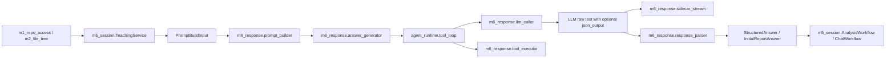
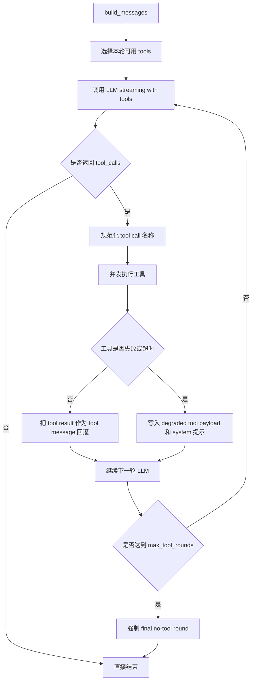

# backend m6_response 模块全面解析

本文面向当前仓库里的 `backend/m6_response/`，目标不是只做文件级简介，而是把这套模块在后端里的真实定位讲清楚：

- `m6` 具体负责什么
- `m6` 的核心实现原理是什么
- `m6` 的内部架构如何分层
- `m6` 的上游输入来自哪里
- `m6` 的下游输出被谁消费
- `m6` 当前有哪些被测试锁死的设计约束

本文基于以下代码路径整理：

- `backend/m6_response/*`
- `backend/m5_session/*`
- `backend/agent_runtime/*`
- `backend/agent_tools/*`
- `backend/contracts/*`
- `backend/llm_tools/*`
- `backend/routes/analysis.py`
- `backend/routes/chat.py`
- `backend/routes/sidecar.py`
- `backend/tests/test_m6_response.py`
- `backend/tests/test_tool_calling.py`
- `backend/tests/test_agent_architecture_refactor.py`
- `backend/tests/test_m5_session.py`
- `backend/tests/test_llm_tools.py`

## 1. 一句话定位

`m6_response` 是 Repo Tutor 后端里的“回答生成层”。

它不负责仓库接入，不负责文件树扫描，也不直接维护会话状态；它做的是把上游已经准备好的“教学状态 + 仓库上下文 + 工具上下文 + 用户问题”转换成：

1. 发给 LLM 的消息
2. 可选的函数调用循环
3. 流式可见文本
4. 隐藏的结构化 sidecar JSON
5. 最终可回写到会话状态里的结构化答案对象

如果把整个后端看成一条链路，`m6` 的位置大致是：



## 2. m6 解决的核心问题

`m6` 这层存在的原因，是因为“让模型回答仓库问题”不是简单地调用一次 LLM。

它要同时解决 5 件事：

| 问题 | m6 的解决方式 |
| --- | --- |
| 怎么把当前回合的教学目标和问题发给模型 | `prompt_builder.build_messages()` |
| 怎么给模型提供足够但不过量的仓库证据 | 上游 `build_llm_tool_context()` 先种子化，`tool_loop` 再按需实时调用工具 |
| 怎么让回答既能流式展示给用户，又能留下结构化字段 | 可见 Markdown 正文 + 隐藏 `<json_output>{...}</json_output>` |
| 怎么让模型在需要时自己读代码，但仍然只读且可控 | `agent_runtime.tool_loop` + `tool_executor` + `agent_tools` 只读工具 |
| 怎么把 LLM 文本恢复成后端可消费的数据结构 | `response_parser.parse_final_answer()` |

换句话说，`m6` 的真正职责是把“面向人类的教学回答”和“面向程序的结构化结果”合并到同一次模型输出里。

## 3. m6 在整体调用链中的位置

### 3.1 初始报告链路

当用户刚提交仓库时，`m6` 不是一定会被调用。

- `backend/m5_session/analysis_workflow.py` 先做仓库接入和文件树扫描
- 然后初始化 teaching state
- 如果当前模式是 `DEEP_RESEARCH` 且仓库主语言是 Python，初始报告走 `backend/deep_research/*`
- 只有在快速导览路径里，才会进入 `m6`

快速导览路径如下：

```text
AnalysisWorkflow._stream_initial_report_answer
-> TeachingService.build_initial_report_prompt_input
-> m6_response.answer_generator.stream_answer_text_with_tools
-> agent_runtime.tool_loop.stream_answer_text_with_tools
-> m6_response.llm_caller.stream_llm_response_with_tools
-> 可选多轮工具调用
-> m6_response.response_parser.parse_final_answer
-> InitialReportAnswer
-> AnalysisWorkflow._complete_initial_report
```

### 3.2 追问聊天链路

用户发送追问时，主路径更稳定地依赖 `m6`：

```text
ChatWorkflow.run
-> TeachingService.build_prompt_input
-> m6_response.answer_generator.stream_answer_text_with_tools
-> agent_runtime.tool_loop.stream_answer_text_with_tools
-> m6_response.llm_caller.stream_llm_response_with_tools
-> 可选多轮工具调用
-> m6_response.response_parser.parse_final_answer
-> StructuredAnswer
-> ChatWorkflow 回写 MessageRecord / suggestions / teaching state
```

### 3.3 sidecar 小解释器链路

`backend/sidecar/explainer.py` 不是完整使用 `m6`，它只复用了 `m6_response.llm_caller.complete_llm_text()` 这一层。

也就是说：

- sidecar 不走 `prompt_builder`
- sidecar 不走 `tool_loop`
- sidecar 不走 `response_parser`
- sidecar 只把一个极短 prompt 发给同一个 LLM transport 层

这说明 `m6` 既是一个完整回答层，也提供了一部分可复用的底层能力。

## 4. m6 的内部架构

从职责上看，`m6_response` 可以拆成 6 个子层。

### 4.1 输入适配层

核心文件：

- `backend/m6_response/answer_generator.py`
- `backend/contracts/domain.py` 里的 `PromptBuildInput`

这一层的作用是统一输入入口。

上游不会直接把一堆零散参数传给模型，而是先由 `TeachingService` 构造 `PromptBuildInput`，里面包含：

- `scenario`
- `user_message`
- `tool_context`
- `conversation_state`
- `history_summary`
- `depth_level`
- `output_contract`
- `enable_tool_calls`
- `max_tool_rounds`

`answer_generator.py` 本身很薄，更多像 facade：

- `stream_answer_text()` 负责非 tool loop 的流式回答
- `parse_answer()` 负责根据 `scenario` 调用 parser
- `output_token_budget()` 负责读取场景预算
- `stream_answer_text_with_tools` 是从 `agent_runtime.tool_loop` 直接 re-export 出来的

这意味着 `answer_generator.py` 并不掌控复杂逻辑，它负责把复杂逻辑组织到统一接口后暴露给 `AnalysisWorkflow` 和 `ChatWorkflow`。

### 4.2 Prompt 组装层

核心文件：

- `backend/m6_response/prompt_builder.py`

`prompt_builder.build_messages()` 负责构造最终发给模型的 `messages`。

它做了几件关键事情：

1. 拼 system rules
2. 插入当前场景和深度说明
3. 插入 `teaching_directive`
4. 插入严格输出要求
5. 插入该场景对应的 JSON sidecar schema
6. 插入工具上下文 payload
7. 回放最近最多 6 条对话历史
8. 把当前用户消息追加到最后

这里有几个设计点很关键。

#### 4.2.1 只把 teaching_directive 作为显式教学控制对象

测试明确约束：

- prompt 里必须有 `teaching_directive`
- 不应再暴露旧的 `teaching_skeleton`
- 不应再暴露 `topic_slice`
- 不应把 `teaching_plan`
- `student_learning_state`
- `teacher_working_log`
- `teaching_decision`

直接塞进 prompt 的控制对象里

这说明当前架构已经从早期“静态分析骨架驱动”切到“动态 teaching directive 驱动”。

#### 4.2.2 对 conversation state 做了裁剪和脱敏

`_sanitize_conversation()` 会从 `conversation_state` 里移除：

- `messages`
- `teaching_plan_state`
- `student_learning_state`
- `teacher_working_log`
- `current_teaching_decision`
- `current_teaching_directive`
- `teaching_debug_events`

`_sanitize_value()` 还会进一步：

- 删除 `root_path`
- 删除 `real_path`
- 删除 `internal_detail`
- 把疑似 secret 替换成 `[redacted_secret]`

所以 `prompt_builder` 并不是把整个 session state 原封不动扔给模型，而是在做一层“最小必要信息投喂”。

#### 4.2.3 助手历史会去掉 `<json_output>`

如果历史消息里已有结构化 sidecar，`build_messages()` 会把它们从 assistant history 里剥掉，再送给模型。

这样做有两个目的：

- 避免模型重复模仿历史 sidecar 内容
- 避免对话历史被机器字段污染

#### 4.2.4 prompt 内提示“工具 schema 通过 API tools 参数传递”

这意味着：

- prompt payload 里只保留 `available_tool_names`
- 真正的 function schema 不重复塞进系统提示文本
- schema 由 API 层的 `tools=` 参数传递

这是一个很合理的分工，避免 system prompt 体积膨胀。

### 4.3 证据供给层

这一层虽然大部分代码不在 `m6_response/` 目录里，但它是 `m6` 的直接依赖，必须一起看。

核心文件：

- `backend/agent_runtime/context_budget.py`
- `backend/agent_runtime/tool_selection.py`
- `backend/agent_tools/analysis_tools.py`
- `backend/agent_tools/repository_tools.py`

这里有一个非常重要的架构点：

## m6 的证据来源分成两类

### 4.3.1 Seeded tool context

也就是回答开始前就预先塞给模型的只读参考材料。

`build_llm_tool_context()` 会按场景预执行一小批 deterministic tools，然后裁剪到预算内。

初始报告默认种子结果：

- `m1.get_repository_context`
- `m2.get_file_tree_summary`
- `m2.list_relevant_files`
- `teaching.get_state_snapshot`

跟进回合默认至少包含：

- `m1.get_repository_context`
- `teaching.get_state_snapshot`

在以下情况下还会追加：

- 当前目标偏 `overview` 或 `structure` 时，补 `m2.get_file_tree_summary` 和 `m2.list_relevant_files`
- 当前目标偏 `entry`、`flow`、`module` 时，补 `m2.list_relevant_files`
- 用户问题明显带源码味道时，补 starter excerpt

starter excerpt 的特点是：

- 只读
- 最多 1 个文件
- 最多 40 或 60 行
- 优先从用户显式提到的文件里抽取

### 4.3.2 Live tool calls

也就是模型在回答过程中临时请求的函数调用。

当前可注册的工具 schema 一共 6 个：

- `m1_get_repository_context`
- `m2_get_file_tree_summary`
- `m2_list_relevant_files`
- `teaching_get_state_snapshot`
- `read_file_excerpt`
- `search_text`

但注意，全部注册不等于全部每轮都开放。

`tool_selection.select_tools_for_turn()` 会按场景和问题再筛一遍。

当前策略非常保守：

- 默认只给 `m2.list_relevant_files` 和 `search_text`
- 初始报告额外允许 `read_file_excerpt`
- 追问中如果目标是 `entry`、`flow`、`module`、`dependency`、`layer`，或问题本身像在问源码，再允许 `read_file_excerpt`

所以现在的设计不是“让模型拥有所有分析工具”，而是“只给它最少够用的仓库读取工具”。

### 4.4 函数调用循环层

核心文件：

- `backend/agent_runtime/tool_loop.py`
- `backend/m6_response/tool_executor.py`

这部分是整套系统里最像 agent runtime 的地方。

`stream_answer_text_with_tools()` 的主循环大致是：



这层有 7 个关键实现细节。

#### 4.4.1 工具执行是并发 batch

一轮里如果模型发出多个 tool calls，`_execute_tool_batch()` 会并发跑。

最后再按 `call_id` 原始顺序回写到对话里，避免返回顺序打乱模型上下文。

#### 4.4.2 有软超时和硬超时

默认超时配置：

- 思考提示延迟：1.5 秒
- 搜索缓慢提示延迟：4.0 秒
- 工具软超时：12.0 秒
- 工具硬超时：20.0 秒

软超时会先发 `slow_warning`，硬超时才真正降级。

#### 4.4.3 工具失败不会让整个回答失败

当工具执行异常或超时时，loop 不会直接抛错中断整个回合，而是生成一个“降级 tool payload”回灌给模型，随后附加 system message：

- 前一个工具失败了
- 继续用已有证据回答
- 必须显式标注不确定性

也就是说，工具调用是“可失败但可继续”的。

#### 4.4.4 达到轮数上限后会强制 no-tool 收尾

`PromptBuildInput.max_tool_rounds` 默认是 50，来源于环境变量 `REPO_TUTOR_MAX_TOOL_ROUNDS`。

到达上限后，loop 会：

- 插入一条 system message，要求模型直接完成回答
- 再发起最后一次 `tools=[]` 的 no-tool round

测试明确锁死了这一行为：50 轮后必须进入 final no-tool round，而不是继续无限要工具。

#### 4.4.5 工具名称存在 API-safe 归一化

例如：

- 内部名字：`m2.list_relevant_files`
- API-safe 名字：`m2_list_relevant_files`

`tool_executor.api_tool_name()` 和 `normalize_tool_name()` 负责这个映射。

这样既兼容 OpenAI tool schema 命名，又能在内部继续保留 dotted name。

#### 4.4.6 ToolStreamActivity 是 m6 和 SSE 之间的桥

tool loop 不只是返回文本，还会返回活动事件：

- `thinking`
- `planning_tool_call`
- `tool_running`
- `tool_succeeded`
- `tool_failed`
- `degraded_continue`
- `waiting_llm_after_tool`
- `slow_warning`

`ChatWorkflow` 和 `AnalysisWorkflow` 再把这些事件转成 `RuntimeEventType.AGENT_ACTIVITY`，前端因此可以实时显示“正在搜索源码”“正在读文件”等状态。

#### 4.4.7 m6 本身不实现工具，只桥接 registry

`m6_response/tool_executor.py` 本质是 registry adapter：

- 接收 LLM 给出的 tool name 和 arguments
- 归一化工具名
- 用 `DEFAULT_TOOL_REGISTRY` 查 `ToolSpec`
- 如果 deterministic，则读写 `ToolResultCache`
- 返回序列化后的 JSON 字符串

它不拥有业务知识，真正的工具定义在 `backend/agent_tools/*`。

### 4.5 LLM transport 层

核心文件：

- `backend/m6_response/llm_caller.py`

这一层负责真正访问 OpenAI-compatible chat completions API。

它提供 3 个入口：

- `stream_llm_response()`：普通 streaming 文本
- `complete_llm_text()`：非 streaming 一次性文本完成
- `stream_llm_response_with_tools()`：支持 streaming + tool_calls

这一层的实现要点如下。

#### 4.5.1 默认是 OpenAI SDK，缺失时回退到 urllib

如果环境里有 `openai` 包：

- 使用 `AsyncOpenAI`
- 调用 `chat.completions.create`

如果没有：

- 用 `_complete_with_stdlib_http()` 直接 POST 到 `/chat/completions`

#### 4.5.2 当前默认面向 DeepSeek 兼容接口

默认配置：

- `DEFAULT_BASE_URL = "https://api.deepseek.com"`
- `DEFAULT_MODEL = "deepseek-chat"`

但接口写法是 OpenAI-compatible 的，所以可以通过环境变量或 `llm_config.json` 指向别的兼容端点。

#### 4.5.3 配置优先级

`load_llm_config()` 的输入来源：

1. 环境变量
2. `llm_config.json`
3. 默认值

关键环境变量：

- `REPO_TUTOR_LLM_API_KEY`
- `REPO_TUTOR_LLM_BASE_URL`
- `REPO_TUTOR_LLM_MODEL`
- `REPO_TUTOR_LLM_TIMEOUT_SECONDS`
- `REPO_TUTOR_LLM_MAX_TOKENS`

#### 4.5.4 当前没有自动重试

`MAX_RETRIES = 0`

这意味着 transport 层默认是“失败即返回错误”，不是“内建多次重试”。

#### 4.5.5 tool streaming 结果会累积 content 和 tool_calls

`stream_llm_response_with_tools()` 会把增量结果收敛成 `StreamResult`：

- `content_chunks`
- `tool_calls`
- `finish_reason`

并支持把增量文本通过 `on_content_delta` 一边收到一边往外发。

#### 4.5.6 stdlib fallback 不支持真实 tool calling

如果 `openai` SDK 缺失，`stream_llm_response_with_tools()` 的 fallback 其实只是做一次普通文本完成，然后返回没有 `tool_calls` 的 `StreamResult`。

这意味着：

- 工具循环在 fallback 模式下会退化成“文本-only”
- 真正的 function calling 依赖 SDK 模式

这是一个很值得记住的边界。

### 4.6 输出清洗与解析层

核心文件：

- `backend/m6_response/sidecar_stream.py`
- `backend/m6_response/response_parser.py`

这层解决的是“同一份模型输出如何同时服务用户和程序”。

#### 4.6.1 sidecar 输出模式

当前约束是：

- 模型给用户的正文是 Markdown
- 正文结束后单独输出 `<json_output>{...}</json_output>`

也就是：

```text
可见教学解释正文
<json_output>{结构化字段}</json_output>
```

#### 4.6.2 为什么需要 JsonOutputSidecarStripper

回答是流式输出的。

如果不处理，前端会直接收到 `<json_output>` 这段机器字段，体验会很差。

`JsonOutputSidecarStripper` 的作用就是：

- 在流式过程中增量识别 `<json_output>...</json_output>`
- 把这段隐藏掉
- 只把可见正文的 chunk 发给前端

它专门处理了一个细节：标签可能跨 chunk 断裂。

例如：

- 第一个 chunk 只到了 `<jso`
- 第二个 chunk 才补成 `<json_output>`

stripper 会把尾部一小段 buffer 留住，等下一块进来再判断，而不是误把半个标签直接输出给前端。

#### 4.6.3 response_parser 首选 JSON sidecar，正文只做兜底

`parse_final_answer()` 的逻辑很明确：

1. 先从 `<json_output>` 或 fenced JSON 中提 payload
2. 再去掉 payload，得到 `visible_text`
3. 根据 `scenario` 解析成：
   - `InitialReportAnswer`
   - `StructuredAnswer`

这说明正文和 JSON sidecar 的优先级不是对等的，JSON sidecar 是主结构来源，正文主要是用户可读内容。

#### 4.6.4 parser 对“下一步建议”非常保守

测试明确锁死了一个行为：

- 如果 structured JSON 里没有 `next_steps`
- 即使正文里有可见 bullet list
- parser 也不会把这些 bullet 自动当成 suggestions

这个限制很重要，它避免了“把普通说明性列表误识别成 UI 可点击下一步”。

#### 4.6.5 parser 有 best-effort fallback

如果 sidecar 丢失、无效或结构不完全合法：

- 初始报告走 `_best_effort_initial_report_content()`
- 结构化回答走 `_parse_structured_content()` 的 fallback

兜底字段包括：

- `focus`
- `direct_explanation`
- `relation_to_overall`
- `evidence_lines`
- `uncertainties`

但 suggestions 默认不会瞎猜。

#### 4.6.6 message_type 由 scenario 决定

对 follow-up 类回答，parser 会根据场景给出不同 `message_type`：

- `GOAL_SWITCH` -> `goal_switch_confirmation`
- `STAGE_SUMMARY` -> `stage_summary`
- 其他 -> `agent_answer`

这保证了下游 message record 的类型和 UI 展示语义一致。

## 5. m6 各子模块逐文件说明

### 5.1 `answer_generator.py`

定位：

- facade
- workflow 与底层 runtime 之间的薄桥接层

关键函数：

- `stream_answer_text()`
- `parse_answer()`
- `output_token_budget()`

特点：

- 不承载复杂业务逻辑
- 通过 `_call_with_optional_max_tokens()` 兼容自定义 streamer 是否接受 `max_tokens`
- 直接把 `stream_answer_text_with_tools` 从 `agent_runtime.tool_loop` 暴露出去

### 5.2 `budgets.py`

定位：

- 统一管理输出预算和工具上下文预算

当前值：

- 所有场景 `output_token_budget = 2400`
- 初始报告 `tool_context_budget = 24000 chars`
- 跟进回合 `tool_context_budget = 12000 chars`

这说明当前项目对输出长度没有做场景差异化，但对上下文预算做了“初始报告更大、聊天回合更小”的区分。

### 5.3 `llm_caller.py`

定位：

- transport 层
- OpenAI-compatible chat completions adapter

关键类：

- `LlmConfig`
- `ToolCallRequest`
- `StreamResult`

关键函数：

- `load_llm_config()`
- `stream_llm_response()`
- `complete_llm_text()`
- `stream_llm_response_with_tools()`

特点：

- 支持 OpenAI SDK 与原生 HTTP 双路径
- 能把 streaming delta 累积成结构化结果
- 能解析 list-based content 形式的 message content
- 错误映射比较直接，没有复杂 retry 策略

### 5.4 `prompt_builder.py`

定位：

- prompt 组装器
- m6 最核心的“上行输入塑形”模块

关键函数：

- `build_messages()`

内部重点：

- `_build_payload()`
- `_tool_context()`
- `_sanitize_conversation()`
- `_scenario_guidance()`
- `_strict_output_requirements()`
- `_json_schema_for_scenario()`

特点：

- 强依赖 `PromptBuildInput`
- 强依赖 `teaching_directive`
- 显式去除旧架构里的 `m3/m4` 静态分析骨架语义
- 做 secret redaction

### 5.5 `response_parser.py`

定位：

- 输出恢复器
- 把 LLM 文本恢复成后端 domain model

关键函数：

- `parse_final_answer()`

内部重点：

- `_extract_payload()`
- `_parse_initial_report_content()`
- `_best_effort_initial_report_content()`
- `_parse_structured_content()`
- `_parse_suggestions()`

特点：

- 优先信任 JSON sidecar
- 对 suggestions 极度保守
- 对无效 sidecar 有兜底

### 5.6 `tool_executor.py`

定位：

- tool loop 和 `DEFAULT_TOOL_REGISTRY` 之间的桥接器

关键函数：

- `execute_tool_call()`
- `tool_schemas_for()`
- `normalize_tool_name()`
- `api_tool_name()`

特点：

- deterministic 结果可缓存
- 未知工具不会抛异常到上层，而是返回 error JSON
- 支持 internal dotted name 和 API-safe name 双向转换

### 5.7 `sidecar_stream.py`

定位：

- 流式侧的输出过滤器

关键类：

- `JsonOutputSidecarStripper`

特点：

- 增量式
- 能处理标签跨 chunk
- 只负责“隐藏 sidecar”，不负责 JSON 解析

### 5.8 `suggestion_generator.py`

定位：

- 基于 `TopicRef` 的建议生成工具函数

关键函数：

- `generate_next_step_suggestions()`

当前现状：

- 代码里存在
- 当前主链路没有实际调用
- 现在更常见的是由 LLM 自己产出 `next_steps`，再由 `TeachingService.ensure_*` 裁剪到最多 3 条

这意味着它更像保留的辅助模块，而不是当前主流程核心组件。

## 6. m6 的关键数据结构

### 6.1 输入侧

| 结构 | 作用 |
| --- | --- |
| `PromptBuildInput` | m6 的统一输入包 |
| `LlmToolContext` | 已裁剪的只读工具上下文 |
| `OutputContract` | 约束回答必须覆盖哪些 section |
| `ConversationState` | 当前教学/会话状态快照 |

### 6.2 输出侧

| 结构 | 作用 |
| --- | --- |
| `StructuredAnswer` | 跟进回合的结构化回答 |
| `InitialReportAnswer` | 初始报告的结构化回答 |
| `StructuredMessageContent` | 跟进回答正文对应的结构化字段 |
| `Suggestion` | 下一个可点击问题或动作 |
| `EvidenceLine` | 证据行 |

### 6.3 transport / tool loop 中间结构

| 结构 | 作用 |
| --- | --- |
| `StreamResult` | 一次 LLM 调用的聚合结果 |
| `ToolCallRequest` | 单个待执行工具调用 |
| `ToolStreamTextDelta` | tool loop 对外发出的文本增量 |
| `ToolStreamActivity` | tool loop 对外发出的活动事件 |

## 7. m6 的上游依赖

### 7.1 直接上游

| 上游模块 | m6 从它拿什么 |
| --- | --- |
| `backend/m5_session/teaching_service.py` | `PromptBuildInput`，包括场景、深度、工具上下文和输出约束 |
| `backend/agent_runtime/context_budget.py` | 预执行后的 `LlmToolContext` |
| `backend/contracts/domain.py` | 输入输出 domain model |
| `backend/contracts/enums.py` | `PromptScenario`、`MessageType`、`DepthLevel` 等枚举 |
| `backend/agent_runtime/tool_selection.py` | 当前回合允许的工具集合 |
| `backend/agent_tools/*` | 真正的工具定义与只读仓库访问能力 |

### 7.2 更上游的前置条件

`m6` 自己不做这些工作，但它要求这些前置条件已经成立：

- `RepositoryContext` 已经建立
- `FileTreeSnapshot` 已经扫描完成
- `ConversationState` 已经初始化
- `TeachingService` 已经推导出当前学习目标和场景

如果没有这些前提，`m6` 其实无法安全地产生一个有意义的仓库回答。

### 7.3 明确“不再依赖”的旧层

从测试约束可以明确看出，当前 m6 已经不再依赖：

- `m3.*`
- `m4.*`
- `teaching_skeleton`
- `topic_slice`
- 静态 repo KB 风格的固定教学骨架

现在改成：

- `m1/m2` 提供确定性仓库表面信息
- `teaching_directive` 提供当前教学控制
- live tool calling 补运行中的源码证据

这是当前架构最大的变化之一。

## 8. m6 的下游依赖

### 8.1 直接消费者

| 下游模块 | 怎么消费 m6 输出 |
| --- | --- |
| `backend/m5_session/analysis_workflow.py` | 消费 `InitialReportAnswer`，写入 `MessageRecord`，结束初始报告 |
| `backend/m5_session/chat_workflow.py` | 消费 `StructuredAnswer`，写入 `MessageRecord`，更新 teaching state |
| `backend/m5_session/runtime_events.py` | 消费文本 delta 和 activity，转为 runtime events |
| `backend/m5_session/event_mapper.py` | 把最终 `MessageRecord` 变成 SSE `message_completed` |
| `backend/routes/analysis.py` / `backend/routes/chat.py` | 通过 SSE 向前端传送 m6 产物 |
| `backend/sidecar/explainer.py` | 只复用 `llm_caller.complete_llm_text()` |

### 8.2 最终落点

`m6` 的结果最终会落到两个地方：

1. 用户可见流
   - `ANSWER_STREAM_START`
   - `ANSWER_STREAM_DELTA`
   - `ANSWER_STREAM_END`
   - `AGENT_ACTIVITY`

2. 持久在内存 session 内的消息记录
   - `ConversationState.messages`
   - `ConversationState.last_suggestions`
   - `ConversationState.explained_items`
   - 教学状态更新后的 plan / student state / working log

注意这里说的“持久”只是持久在当前内存 session 中，不是数据库持久化。

## 9. m6 的实现原理总结

如果把 m6 的实现原则压缩成几条，可以概括为：

### 9.1 先给模型一小批确定性证据，再允许它按需继续取证

也就是：

- 先 seed
- 再 live call

这样能减少模型一上来就盲目读文件的概率。

### 9.2 可见回答和结构化结果分离，但共用同一次模型输出

也就是：

- 用户看 Markdown
- 机器看 `<json_output>`

这比“第二次再让模型格式化成 JSON”更省调用次数，也更不容易出现正文与结构化字段不一致。

### 9.3 对工具和建议都采取保守策略

保守体现在：

- 只提供少量只读工具
- 限制工具轮数
- 工具失败时继续但标不确定
- 没有 sidecar 结构时，不从正文 bullet 硬猜 suggestions

### 9.4 m6 本身不拥有业务真相，只做编排和适配

它不判断仓库怎么扫描，不决定 session 状态机，不决定教学 plan 怎么演化，不定义具体工具读取逻辑。

它的作用更像：

- transformer
- orchestrator
- adapter

而不是 source of truth。

## 10. 关键测试约束

如果后续要改 m6，这些行为基本可以视为“现有契约”。

### 10.1 Prompt 契约

由 `backend/tests/test_m6_response.py` 与 `backend/tests/test_agent_architecture_refactor.py` 锁定：

- 初始报告和 follow-up prompt 都必须包含 `teaching_directive`
- 不应再包含 `teaching_skeleton`
- 不应再包含 `topic_slice`
- 不应暴露 `m4.get_initial_report_skeleton`
- 不应暴露 `m4.get_topic_slice`
- 助手历史消息里的 `<json_output>` 必须被剥离

### 10.2 Tool calling 契约

由 `backend/tests/test_tool_calling.py` 锁定：

- tool registry 暴露的 schema 只限 m1/m2/teaching/source readers
- 允许多轮 tool calls
- 11 轮仍然可以继续，不会过早降级
- 默认 50 轮后必须进入 final no-tool round
- 工具超时应该降级继续，而不是整轮失败

### 10.3 Parser 契约

由 `backend/tests/test_m6_response.py` 锁定：

- 跟进回答优先从 structured JSON 读 `next_steps`
- 如果结构里没有 suggestions，正文 bullet 不能被误解析成 suggestions
- 初始报告没有结构化 suggestions 时，正文 bullet 也不能被当成下一问
- sidecar 跨 chunk 时，stripper 仍要正确隐藏

### 10.4 Tool context 契约

由 `backend/tests/test_llm_tools.py` 锁定：

- 初始报告 tool context 应保持小而 source-driven
- deterministic seed result 要走缓存
- 仓库读取工具必须是只读
- 读取结果必须做 secret redaction

## 11. 当前架构的优点与局限

### 11.1 优点

- 架构边界清楚，m6 不直接侵入 session 状态机
- 既支持流式正文，也支持结构化消费
- 工具层只读、可裁剪、可缓存
- 工具失败时系统仍然可继续回答
- 旧的静态骨架依赖被剥离，回答更 source-driven

### 11.2 局限

- `llm_caller` 默认不重试，网络抖动时韧性一般
- 没有 OpenAI SDK 时，tool calling 实际会退化
- `suggestion_generator.py` 当前未走主链路，存在一定“备用模块”味道
- 输出 token budget 目前所有场景统一 2400，没有按场景进一步细化
- parser fallback 虽然稳妥，但 sidecar 如果长期不稳定，回答质量仍会明显下降

## 12. 最后结论

当前 `backend/m6_response` 不是一个“文本生成小模块”，而是整个 Repo Tutor 回答系统的中枢适配层。

它的核心价值有三点：

1. 把教学状态、安全工具、仓库证据和用户问题压成同一份模型输入
2. 用可控的 tool loop 让模型在回答过程中继续取证
3. 把一次 LLM 输出同时变成人类可读正文和程序可消费结构化结果

如果继续演进这套架构，最值得关注的点通常不会是“再多写一点 prompt”，而是下面三件事：

- tool context 还能否进一步压缩得更准
- tool loop 的超时和降级策略是否需要更细
- sidecar JSON 的稳定性是否需要更强的 schema 约束或校验

从当前代码和测试来看，m6 的设计方向已经非常明确：

- 不走静态知识库式回答
- 不走无限制 agent
- 走的是“教学控制 + 只读取证 + 结构化输出”的保守型源码讲解架构

